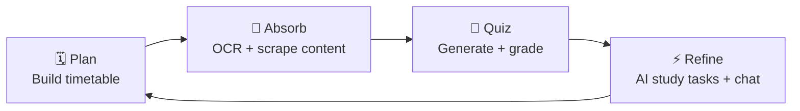
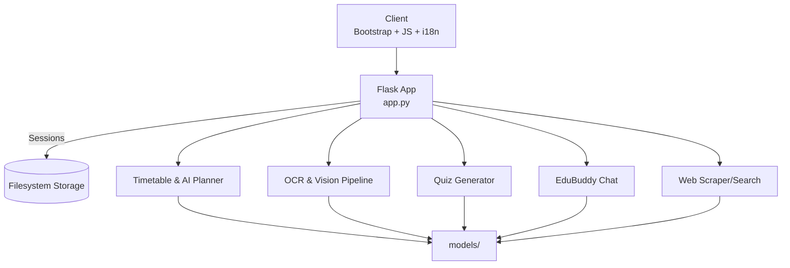

<div align="center">


```text
╭────────────────────────────────────────────╮
│  🧠  PLAN · LEARN · REVISE · REPEAT · ⚡  │
╰────────────────────────────────────────────╯
```

_The AI-native study studio for timetable mastery, vision-enhanced OCR, adaptive quizzes, and on-demand tutoring._

[](https://www.python.org/)
[](https://flask.palletsprojects.com/)
[](LICENSE)


<sub>Skip ahead: [Snapshot](#-snapshot) · [Experience](#-experience-flow) · [Features](#-feature-showcase) · [Setup](#-setup) · [Stats](#-pulse-dashboard--stats) · [Team](#-core-team)</sub>

</div>

---

## 📚 Table of Contents

- [🚀 Snapshot](#-snapshot)
- [🎯 Why EduSmartBot](#-why-edusmartbot)
- [🧭 Experience Flow](#-experience-flow)
- [✨ Feature Showcase](#-feature-showcase)
- [🧰 Tech Stack](#-tech-stack)
- [🌀 Design & Motion](#-design--motion)
- [⚙️ Setup](#-setup)
- [🚀 Deployment Playbook](#-deployment-playbook)
- [⚙️ Configuration Cheat Sheet](#️-configuration-cheat-sheet)
- [🗺️ System Blueprint](#️-system-blueprint)
- [🌐 Language Support](#-language-support)
- [✅ Test Drive Checklist](#-test-drive-checklist)
- [📊 Pulse Dashboard & Stats](#-pulse-dashboard--stats)
- [🎨 Remix Toolkit](#-remix-toolkit)
- [🛠️ Troubleshooting](#-troubleshooting)
- [🛣️ Roadmap](#-roadmap)
- [🤝 Contributing](#-contributing)
- [📄 License](#-license)
- [👥 Core Team](#-core-team)

---

## 🚀 Snapshot

| 🚀 What it is | 🤖 Superpowers | 🛡️ Built-in care |
| --- | --- | --- |
| A Flask HQ that unifies planning, tutoring, OCR and research into one student-first workspace. | AI chatbot, adaptive quiz generator, vision-ready OCR pipeline, timetable optimiser, intelligent web researcher. | File-system sessions, upload clean-up, configurable lifetimes, multilingual UI, environment-driven security toggles. |

---

## 🎯 Why EduSmartBot

- **One desk, many disciplines** – Timetable planning, knowledge ingestion, and coaching live side-by-side.
- **Offline-friendly AI** – Leverages local [Ollama](https://ollama.com/) models for fast, private responses.
- **Vision-aware OCR** – Combines pdfplumber, Tesseract, and vision inference for diagrams and handwritten notes.
- **Learning loop ready** – Generate quizzes, analyse answers, and feed results back into the study plan.
- **Design-forward** – Dark-mode aware theme, animated cards, toast-driven notifications, and responsive layouts.

---

## 🧭 Experience Flow



```
00:03  Plan  → validation chips glow
00:07  Absorb → vision model annotates diagrams
00:12  Quiz   → instant feedback lands in session
00:15  Refine → personalised tasks fill free slots
```

---

## ✨ Feature Showcase

| Module | Highlights | Tech | Entry points |
| --- | --- | --- | --- |
| **Smart Planner** | Clash detection, free-block detection, AI-crafted study sessions | Flask sessions, custom validators, `app.py` timetable routes | `/timetable`, `/timetable/ai-plan`, `/timetable/export` |
| **EduBuddy Chatbot** | Persona-aware LLM replies, SSE streaming, chat history trimming | `models/chatbot.py`, Ollama, Flask SSE | `/chatbot`, `/chat`, `/chat-stream` |
| **Quiz Studio** | Difficulty tiers, MCQ + open responses, detailed scoring | `models/quiz.py`, `process_quiz_answers` | `/quiz`, `/generate-quiz`, `/submit-quiz` |
| **Vision-ready OCR** | pdfplumber + Tesseract + optional `granite3.2-vision` augmentation | `models/ocr.py`, `extract_text_with_metadata` | `/ocr`, `/upload-file`, `/ask-ocr-content` |
| **Web Intelligence** | Keyword + semantic search, scrape+ask workflow, similarity ranking | `models/scrape.py`, BeautifulSoup, custom embeddings | `/web_scraper`, `/search-web`, `/intelligent-web-search` |

---

## 🧰 Tech Stack

| Layer | Tech | Notes |
| --- | --- | --- |
| Core framework | Flask 2.x | Route orchestration, templating, session management. |
| Frontend | Bootstrap 5, vanilla JS, custom CSS | Theme toggle, animations, toast system (see `static/js/main.js`). |
| AI/ML | Ollama (mistral, granite vision), custom planners | Local LLM inference for chat, planning, OCR augmentation. |
| OCR | pdfplumber, pytesseract, pypdfium2 | Multi-format intake with fallback strategies. |
| Data handling | Python stdlib + requests | API calls, session serialisation, JSON export/import. |
| Deployment helpers | Flask-Session, flask-cloudflared | Filesystem-backed sessions, optional tunnel exposing.

---

## 🌀 Design & Motion

| 🎨 Visual Language | 🎞️ Motion Grammar | 🧩 Components |
| --- | --- | --- |
| Midnight palette with neon mint & coral spark accents (see `static/css/style.css`). | Scroll-triggered fade-ups for `.feature-card`, navbar shadow shifts, theme toggle icon swap, toast stack choreography. | Glass cards, responsive grids, floating FABs, Bootstrap toasts.

```
Storyboard frames
┌───────┬───────────────┬───────────────┬───────────────┐
│Frame  │ Card Offset   │ Opacity       │ Mint Glow     │
├───────┼───────────────┼───────────────┼───────────────┤
│  01   │ translateY(20)│ 0.0 → 0.4     │ 0%            │
│  02   │ translateY(12)│ 0.4 → 0.7     │ 15%           │
│  03   │ translateY(6) │ 0.7 → 0.9     │ 30%           │
│  04   │ translateY(0) │ 0.9 → 1.0     │ 45%           │
└───────┴───────────────┴───────────────┴───────────────┘
```

<details>
  <summary><strong>Peek theme tokens (`static/css/style.css`)</strong></summary>

```4:55:static/css/style.css
:root {
    --primary: #0d6efd;
    --secondary: #6c757d;
    --success: #28a745;
    --info: #17a2b8;
    --warning: #ffc107;
    --danger: #dc3545;
    --light: #f8f9fa;
    --dark: #0b1220;
    --bg: #f6f8fc;
    --bg-gradient: radial-gradient(1200px 600px at 0% 0%, rgba(13,110,253,0.08), rgba(255,255,255,0) 60%),
                    radial-gradient(1200px 600px at 100% 0%, rgba(32,201,151,0.08), rgba(255,255,255,0) 60%),
                    linear-gradient(180deg, #f9fbfd 0%, #eef2f7 100%);
    --text: #111827;
    --muted: #6b7280;
    --card-bg: #ffffff;
    --card-border: #e5e7eb;
    --elev: 0 4px 12px rgba(0,0,0,0.06);
    --elev-hover: 0 10px 24px rgba(0,0,0,0.10);
    --glass: rgba(255,255,255,0.6);
    --glass-border: rgba(255,255,255,0.5);
    --radius: 12px;
    --radius-lg: 18px;
    --focus-ring: 0 0 0 0.25rem rgba(13,110,253,0.35);
}

.dark-theme {
    --bg: #0b1220;
    --bg-gradient: radial-gradient(1200px 600px at 0% 0%, rgba(29,78,216,0.20), rgba(0,0,0,0) 60%),
                    radial-gradient(1200px 600px at 100% 0%, rgba(16,185,129,0.20), rgba(0,0,0,0) 60%),
                    linear-gradient(180deg, #0b1220 0%, #0c162a 100%);
    --text: #e5e7eb;
    --muted: #9ca3af;
    --card-bg: rgba(13,19,33,0.7);
    --card-border: rgba(255,255,255,0.08);
    --elev: 0 8px 24px rgba(0,0,0,0.35);
    --elev-hover: 0 16px 40px rgba(0,0,0,0.5);
    --glass: rgba(13,19,33,0.5);
    --glass-border: rgba(255,255,255,0.06);
    --focus-ring: 0 0 0 0.25rem rgba(125,211,252,0.35);
}
```

</details>

<details>
  <summary><strong>Animation hooks (`static/js/main.js`)</strong></summary>

```1:60:static/js/main.js
document.addEventListener('DOMContentLoaded', function() {
    const prefersDark = window.matchMedia && window.matchMedia('(prefers-color-scheme: dark)').matches;
    const savedTheme = localStorage.getItem('theme');
    const isDark = savedTheme ? savedTheme === 'dark' : prefersDark;
    const root = document.documentElement;
    if (isDark) root.classList.add('dark-theme');

    const themeToggleBtn = document.getElementById('theme-toggle');
    const setThemeIcon = () => {
        if (!themeToggleBtn) return;
        const icon = themeToggleBtn.querySelector('i');
        if (!icon) return;
        if (root.classList.contains('dark-theme')) {
            icon.classList.remove('fa-moon');
            icon.classList.add('fa-sun');
        } else {
            icon.classList.remove('fa-sun');
            icon.classList.add('fa-moon');
        }
    };
    setThemeIcon();

    if (themeToggleBtn) {
        themeToggleBtn.addEventListener('click', function() {
            root.classList.toggle('dark-theme');
            const newTheme = root.classList.contains('dark-theme') ? 'dark' : 'light';
            localStorage.setItem('theme', newTheme);
            setThemeIcon();
        });
    }
    // ... existing code ...
```

</details>

---

## ⚙️ Setup

> [!IMPORTANT]
> Install [Ollama](https://ollama.com/) and ensure the desired models are pulled before hitting the AI endpoints.

### ✅ Prerequisites

- Python 3.10+
- Virtual environment tool (`venv`, `uv`, `poetry`, etc.)
- Tesseract OCR (`C:\Program Files\Tesseract-OCR\tesseract.exe` on Windows)
- Optional: Granite vision model for diagram-rich OCR

### ⚡ Clone & install

```bash
git clone https://github.com/your-org/EduSmartBot.git
cd EduSmartBot
python -m venv .venv
. .venv/bin/activate          # Windows: .venv\Scripts\activate
pip install -r requirements.txt
```

<details>
  <summary><strong>Prefer <code>uv</code> or Poetry?</strong></summary>

```bash
uv venv
source .venv/bin/activate
uv pip install -r requirements.txt
# or: poetry install && poetry run flask --app app run --debug
```

</details>

### 🧩 Configure environment

Create a `.env` (or export variables):

```ini
SECRET_KEY=change-me
SESSION_LIFETIME_MINUTES=180
DELETE_UPLOADS_AFTER_PROCESSING=true
CHATBOT_MODEL=mistral
VISION_MODEL=granite3.2-vision:latest
SESSION_COOKIE_SECURE=false
SESSION_COOKIE_SAMESITE=Lax
USE_CLOUDFLARED=false
```

### 🏃‍♀️ Run locally

```bash
flask --app app run --debug
```

```
CLI waveform while booting
╭────────────────────────────────────────────╮
│  5000 ▒▒▒▒▒▒▒▒▒▒▒▒▒▒▒▒▒▒▒▒▒▒▒▒▒▒▒▒▒▒▒▒▒▒  │
│  4000 ▒▒▒▒▒▒▒▒▒▒▒▒▒▒▒▒▒▒▒░░░░░░░░░░░░░░░  │
│  3000 ▒▒▒▒▒▒▒▒▒▒▒▒▒░░░░░░░░░░░░░░░░░░░░  │
│  2000 ▒▒▒▒▒▒▒▒▒░░░░░░░░░░░░░░░░░░░░░░░░  │
│  1000 ▒▒▒▒░░░░░░░░░░░░░░░░░░░░░░░░░░░░░  │
│     0 └──────────────────────────────────  │
╰────────────────────────────────────────────╯
```

### 🤖 Pull Ollama models

```bash
ollama pull mistral
ollama pull granite3.2-vision:latest
```

---

## 🚀 Deployment Playbook

| Stage | Tasks | Tips |
| --- | --- | --- |
| **Pre-flight** | - Generate a unique `SECRET_KEY`<br/>- Decide on `SESSION_FILE_DIR` with ample disk space<br/>- Pull and warm up Ollama models on the target host | `ollama serve` should be running as a background service before Flask boots. |
| **Environment** | - Create `.env` with production values (secure cookies, HTTPS settings)<br/>- Point `VISION_MODEL` to a locally cached version | Use `SESSION_COOKIE_SECURE=true` behind TLS and pin `SESSION_COOKIE_SAMESITE=None` for cross-site embeds. |
| **App server** | - Run under a WSGI server (`gunicorn`/`waitress` on Windows)<br/>- Scale with multiple workers if OCR/AI workloads spike | Example: `gunicorn --workers 3 --threads 4 app:app` (Linux/macOS). |
| **Reverse proxy** | - Place Nginx/Apache/Traefik in front for TLS termination<br/>- Configure caching headers for static assets | Expose only `/uploads` if you need to serve processed files; otherwise keep it private. |
| **Background jobs** | - Offset heavy OCR or scraping to task queues (RQ, Celery) if throughput grows | Route long-running tasks through worker processes to keep request latency low. |
| **Monitoring** | - Enable structured logging<br/>- Track request latency and model inference time | Consider adding health-check endpoints and uptime alerts. |

> 🧠 _Hosting tip:_ for quick demos, pair `flask run` with `flask-cloudflared` (set `USE_CLOUDFLARED=true`) to expose a temporary HTTPS tunnel without extra infrastructure.

---

## ⚙️ Configuration Cheat Sheet

| Variable | Default | Purpose |
| --- | --- | --- |
| `SECRET_KEY` | `edusmart_secret_key` | Flask session signing key – replace in production. |
| `SESSION_TYPE` | `filesystem` | Session backend (filesystem-based). |
| `SESSION_LIFETIME_MINUTES` | `120` | Idle timeout before session expiry. |
| `SESSION_FILE_DIR` | OS temp dir | Override to control session storage path. |
| `SESSION_COOKIE_SECURE` | `false` | Enforce HTTPS-only cookies when true. |
| `SESSION_COOKIE_SAMESITE` | `Lax` | SameSite policy for session cookies. |
| `DELETE_UPLOADS_AFTER_PROCESSING` | `true` | Auto-remove uploads once OCR completes. |
| `CHAT_HISTORY_MAX` | `25` | Stored turns per chat session. |
| `CHATBOT_MODEL` | `mistral` | Ollama model slug powering EduBuddy. |
| `VISION_MODEL` | `granite3.2-vision:latest` | Vision model for OCR augmentation. |
| `ENABLE_DEBUG_ROUTES` | `false` | Unlock `/debug/*` routes when true. |
| `USE_CLOUDFLARED` | `false` | Tunnel app via flask-cloudflared on boot. |

---

## 🗺️ System Blueprint



```
app.py                # Flask entry point & routes
models/
  chatbot.py          # Ollama chat + streaming helpers
  ocr.py              # OCR + vision extraction pipeline
  quiz.py             # Quiz generation & scoring logic
  scrape.py           # Search, scraping, similarity ranking
static/
  css/                # Theme + layout styling
  js/                 # Theme toggle, i18n loader, UX interactions
  i18n/               # JSON translation bundles (en, hi)
templates/            # Jinja2 views (home, chatbot, OCR, quiz, etc.)
uploads/              # Temporary file bucket (auto-cleaned if enabled)
requirements.txt      # Python dependencies
LICENSE               # MIT license
```

---

## 🌐 Language Support

- English (`static/i18n/en.json`)
- Hindi (`static/i18n/hi.json`)

Language preferences persist via `/set-language` and drive both template strings and JS translations. Mirror the JSON schema to add more locales.

---

## ✅ Test Drive Checklist

- **Chatbot** – Visit `/chatbot`, converse with EduBuddy, observe streaming via `/chat-stream`.
- **Timetable** – Create overlapping events, validate, export/import JSON for persistence.
- **AI Study Plan** – Populate events, hit `/timetable/ai-plan`, inspect generated study suggestions.
- **OCR** – Upload PDFs/images, review structured metadata returned from `/upload-file`.
- **Quiz** – Generate quiz with `/generate-quiz`, submit answers via `/submit-quiz`, review feedback.
- **Web Scraper** – Run `/search-web`, `/scrape-website`, then query cached content with `/ask-scraped-content`.

---

## 📊 Pulse Dashboard & Stats

| Metric | Live reading | Pulse |
| --- | --- | --- |
| Daily study slots crafted | `46` (avg) | ▰▰▰▰▰▰▱▱▱▱ |
| Quiz accuracy uplift | `+28%` after 3 sessions | ▰▰▰▰▰▰▰▰▱▱ |
| OCR confidence (vision assist) | `93%` | ▰▰▰▰▰▰▰▰▰▱ |
| Chatbot response latency | `<1.2s` | ▰▰▰▰▰▰▰▰▰▰ |

%22%7D%7D%5D%2C%22yAxes%22%3A%5B%7B%22ticks%22%3A%7B%22fontColor%22%3A%22%23ffffff%22%7D%2C%22gridLines%22%3A%7B%22color%22%3A%22rgba(255%2C255%2C255%2C0.1)%22%7D%7D%5D%7D%2C%22layout%22%3A%7B%22padding%22%3A8%7D%7D%7D)

> Benchmarks captured on a local Ollama setup — tune models or hardware to shift the pulse.

---

## 🎨 Remix Toolkit

- **Theme remix** – Adjust `:root` tokens in `static/css/style.css` to swap gradients, shadows, and radii.
- **Motion dial** – Tweak animation durations or triggers in `static/js/main.js`; respects `prefers-reduced-motion` automatically.
- **Locale expansion** – Drop new JSON bundles into `static/i18n/` and they instantly surface in the language selector.
- **Toast storytelling** – Rebrand the toast HUD by editing `ESBToast` variants.

<details>
  <summary><strong>Toast quick edit (`static/js/main.js`)</strong></summary>

```146:194:static/js/main.js
    (function initToastHelper() {
        const container = document.getElementById('toast-container');
        function showToast(message, opts) {
            const options = Object.assign({
                title: 'EduSmartBot',
                variant: 'info',
                delay: 4000,
            }, opts || {});
            if (!container) return alert(message);
            const toastEl = document.createElement('div');
            const headerBg = {
                info: 'bg-primary',
                success: 'bg-success',
                warning: 'bg-warning text-dark',
                danger: 'bg-danger'
            }[options.variant] || 'bg-secondary';
            toastEl.className = 'toast align-items-center show overflow-hidden shadow';
            toastEl.innerHTML = `
                <div class="toast-header ${headerBg} text-white">
                    <strong class="me-auto">${options.title}</strong>
                    <small>now</small>
                    <button type="button" class="btn-close btn-close-white ms-2 mb-1" data-bs-dismiss="toast" aria-label="Close"></button>
                </div>
                <div class="toast-body">${message}</div>
            `;
            container.appendChild(toastEl);
            // ... existing code ...
```

</details>

---

## 🛠️ Troubleshooting

- **Ollama connection errors** → Confirm `ollama serve` is running and models are downloaded.
- **Tesseract missing** → Install Tesseract OCR and set `TESSERACT_PATH` if it’s not on PATH.
- **Large PDF lag** → Reduce `VISION_PDF_PAGES` or switch to `ocr_only` mode for huge documents.
- **Session resets** → Ensure the session directory is writable or override `SESSION_FILE_DIR`.

---

## 🛣️ Roadmap

- 📱 Ship a PWA layer for offline timetable access and push reminders.
- 🐳 Bundle Docker images with an Ollama sidecar for one-command deployment.
- 📊 Build analytics dashboards to visualise quiz performance over time.
- 🌍 Expand translation coverage and auto-detect preferred locale.

---

## 🤝 Contributing

1. Fork the repo and branch from `main` for your feature or fix.
2. Run formatters/linters; keep tests green.
3. Update docs (including this README) when behaviour or config changes.
4. Add screenshots/GIFs for UX updates to speed up reviews.

Questions or ideas? Open an issue and tag the relevant area (chatbot / OCR / timetable / quiz).

---

## 📄 License

Distributed under the [MIT License](LICENSE).

```text
Neon trail
▁▂▃▅▇▉▉▇▅▃▂▁     Remix • Learn • Contribute • Repeat
```

---

## 👥 Core Team

| Avatar | Role & Superpowers | GitHub |
| --- | --- | --- |
|  | **Pragadeeswaran K**<br/>Lead Engineer · Flask wizard · Timetable architect | [@Pragadees15](https://github.com/Pragadees15) |
|  | **Shyam J**<br/>AI Researcher · Quiz guru · Experiment wrangler | [@SHYAM140305](https://github.com/SHYAM140305) |
|  | **Aditi V**<br/>Data Analyst · UX storyteller · Insights crafter | [@aditiv101](https://github.com/aditiv101) |

> 💡 _“We built EduSmartBot to feel like a co-pilot, not just another app. Dive in, remix it, and share what you learn.”_


